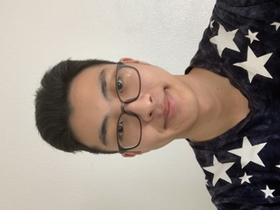

# User Page
Welcome to my user page!
## About Me

#### As a programmer
Admittedly, I don't know nearly as much as I would like to.  
Languages learned:  
1. C/C++
2. C# (a very small amount)  
3. Java
4. Python (also a very small amount)

    
**As most students say at UCSD:**  
> Start early, Start often  
  
which I try to practice, but obviously it's not the easiest to always stick to this rule.